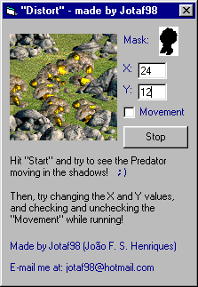



## Distortion Field

### Description

This function basically mixes all the pixels in an area of an image, defined by a mask image. The result is much like the invisibility effect used in the movie "The Predator", very cool if you want a small, quick function for that effect in your games! (It looks like the Predator is made of water or something)

The image doesn't quite reproduce the effect, I just used PrintScreen 3 times, that's all. It has about 100 frames per second in the real code ;)
 
### More Info
 
All you need to give is an image, the mask image, the coordinates where the effect will appear, and the height/width of the image (basically ScaleHeight and ScaleWidth of the form or picturebox).

You don't need to know anything at all. Just add the .bas file and call the function.

If you use this function too much (large mask image or used many times), it may slow down because of the calculations it must do.

             |
---                |---
**Submitted On**   |2000-07-15 12:27:06
**By**             |[Jotaf98](https://github.com/Planet-Source-Code/PSCIndex/blob/master/ByAuthor/jotaf98.md)
**Level**          |Intermediate
**User Rating**    |4.2 (25 globes from 6 users)
**Compatibility**  |VB 3\.0, VB 4\.0 \(16\-bit\), VB 4\.0 \(32\-bit\), VB 5\.0, VB 6\.0, VB Script, ASP \(Active Server Pages\) 
**Category**       |[Graphics](https://github.com/Planet-Source-Code/PSCIndex/blob/master/ByCategory/graphics__1-46.md)
**World**          |[Visual Basic](https://github.com/Planet-Source-Code/PSCIndex/blob/master/ByWorld/visual-basic.md)
**Archive File**   |[CODE\_UPLOAD78217152000\.zip](https://github.com/Planet-Source-Code/jotaf98-distortion-field__1-9792/archive/master.zip)

